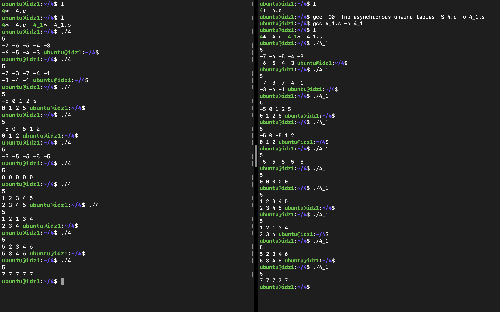
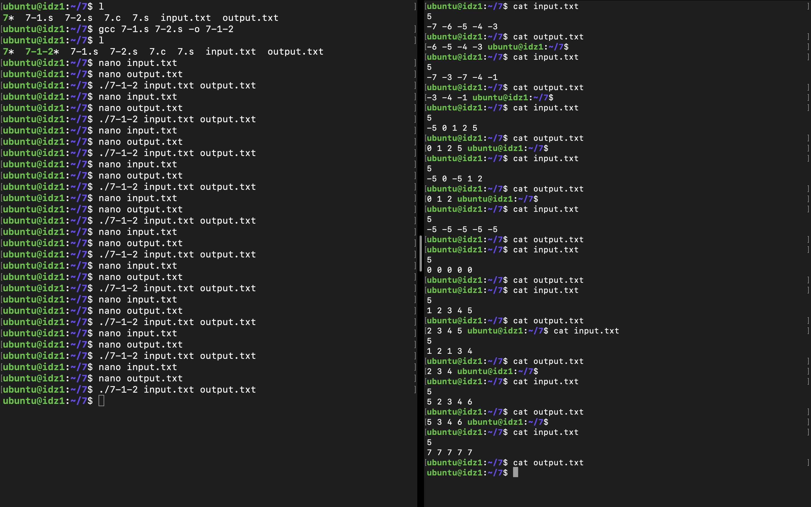

# Архитектура вычислительных систем

## Индивидуальное домашнее задание №1

### Швецов Данил Игоревич, БПИ219

#### Вариант 13
Задание: Сформировать массив B из элементов массива A, за исключением элементов, значения которых совпадают с минимальным элементом массива A.

## Отчет

### Оценка 4

* Написанное решение программы на C:
>

* Программа откомпилирована без оптимизирующих и отладочных опций, убраны лишние макросы за счет использования соответствующих аргументов командной строки с помощью следующих инструкций интерпретатора:
    * $ gcc -O0 -Wall -fno-asynchronous-unwind-tables 4.c -o 4
    * $ gcc -O0 -Wall -fno-asynchronous-unwind-tables -S 4.c -o 4_1.s
    * $ gcc 4_1.s -o 4_1

  В результате получены 2 исполняемые программы "4" и "4_1", которые можно запустить из той же директории с помощью команд:
  * ./4
  * ./4_1

  Приведем примеры тестовых покрытий для обеих программ:
  >
  
  Итак, представлено полное тестовое покрытие, дающее одинаковый результат на обеих программах. Проанализировав полученные результаты, можно сделать вывод, что выполняется условие эквивалентности функционирования двух программ, и все работает корректно. 
  
  Также стоит отметить, что в откомпилированную программу были добавлены комментарии, поясняющие эквивалентное представление переменных в программе на C.

### Оценка 5

* Модифицированное решение программы на C (добавлено использование функций с передачей данных через параметры, в самих функциях использованы локальные переменные):
>

  Кратко опишем функционал модифицированной программы (или то, какой функционал выполняют конкретные функции программы):
* int get_input_and_find_min(int *A, int N) -> данная функция получает на вход указатель на исходный массив, который будет заполнен данными, а также размер данного массива (или количество чисел, которые будут введены пользователем). Затем программа заполняет массив числами и одновременно ищет минимальное число, которое впоследствии использует в качестве возвращаемого значения.
* int func(int *A, int *B, int N, int mi) -> данная функция получает на вход указатель на массив А (уже заполненный введенными пользователем числами), указатель на массив B, который будет сформирован впоследствии на основе задания текущего варианта, размер данных массивов (или количество чисел, которые были введены пользователем), а также минимальный элемент, найденный в исходном массиве А. Данная функция ищет все элементы, не равные минимальному, заполняет ими массив B и возвращает количество элементов нового массива B.
* void print_result(int *B, int counter) -> данная функция получает на вход указатель на массив B, заполненный числами, отличающимися от минимального, а также количество этих чисел. Затем в цикле выводятся на экран данные числа.

Также стоит отметить, что в ассемблерную программу при вызове функций были добавлены комментарии, описывающие передачу фактических параметров и перенос возвращаемого результата. Комментарии, описывающие связь между параметрами языка Си и регистрами (стеком) отсутствуют, так как в функциях программы нет формальных параметров.

### Оценка 6

В дополнение к требованиям на предыдущую оценку мной был произведен рефакторинг программы на ассемблере за счет максимального использования регистров процессора, было произведено добавление данной программы к уже представленным, а также были добавлены комментарии в разработанную программу, поясняющие эквивалентное использование регистров вместо переменных исходной программы на C. С результатами выполненной работы можно ознакомиться в файле "6.s" (файлы "6-1.s" и "6-2.s" - та же программа разбитая на две единицы компиляции).

Также я заменил команды (например, movl на movq) и изменил их взаимодействие с новыми, появившимися регистрами.

Ниже представлено полное тестовое покрытие, дающее одинаковый результат на обеих программах. Проанализировав полученные результаты, можно сделать вывод, что выполняется условие эквивалентности функционирования двух программ, и все работает корректно.
>

### Оценка 7

В дополнение к требованиям на предыдущую оценку мной была произведена реализация программы на ассемблере, полученной после рефакторинга, в виде двух или более единиц компиляции (файлы "7-1.s" и "7-2.s"), а также были заданы файл с исходными данными (input.txt) и файл для вывода результатов (output.txt) с использованием аргументов командной строки.

Теперь откомпилировать и запустить программу можно следующим образом (первый пункт - программа с одной единицей компиляции, второй - программа с двумя единицами компиляции):
1) 
   * $ gcc 7.s -o 7
   * $ ./7 input.txt output.txt
   >
2) 
   * $ gcc 7-1.s 7-2.s -o 7-1-2
   * $ ./7-1-2 input.txt output.txt
   >
   
Как можно заметить, выше представлено полное тестовое покрытие, дающее одинаковый результат на обеих программах. Проанализировав полученные результаты, можно сделать вывод, что выполняется условие эквивалентности функционирования двух программ, и все работает корректно.
